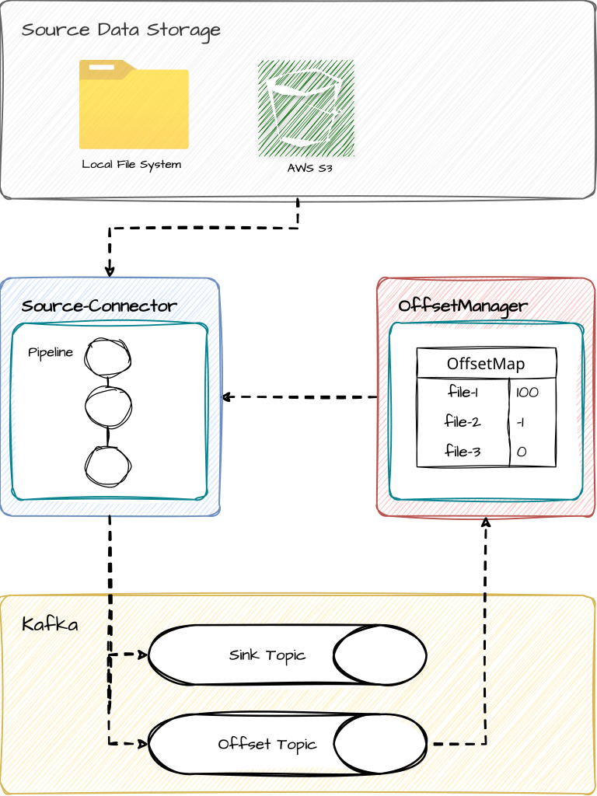
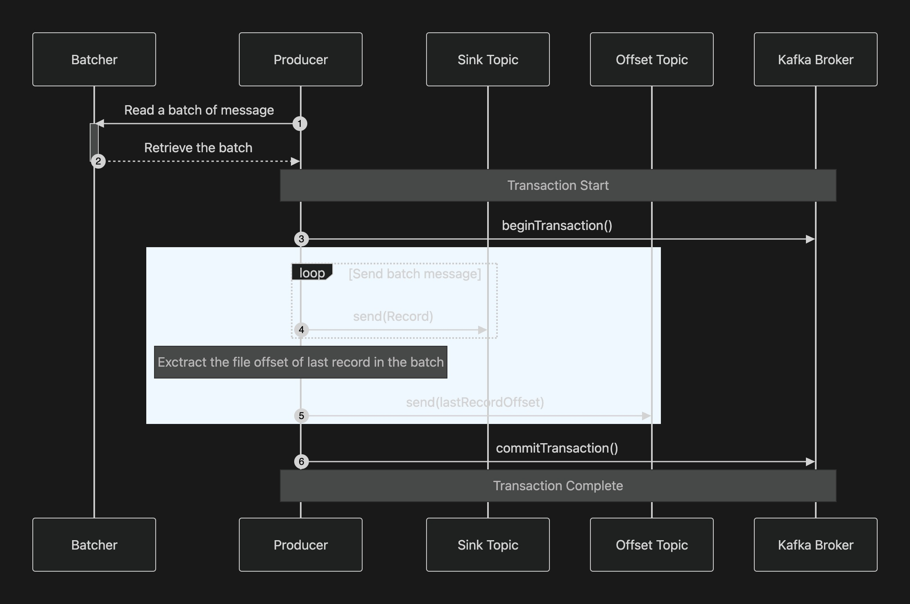
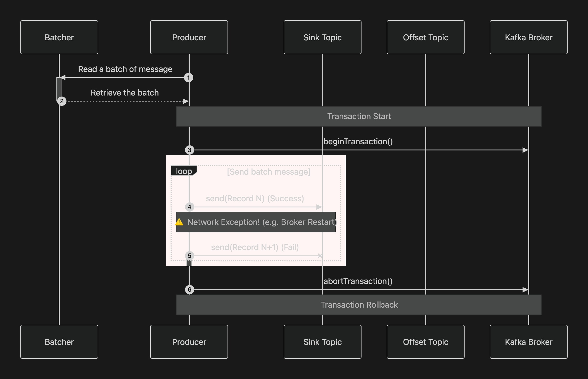

## Introduction
Source Connect provides the ETL pipeline from file source to the kafka with Exactly Once Semantics.


## Motivation

Every storage source connector has to answer one question: *how do we remember which records we
already sent?* Kafka Connect answers it with the connector offset topic, which the framework commits
on its own schedule — separately from the records themselves. That gap is why FilePulse, Aiven, and
Confluent all document at-least-once delivery. There are duplicated data. If a task dies after its records reach the broker but
before its progress is committed, the next run re-reads the same lines and sends them again. 

Source Connect closes the gap by refusing to keep progress outside the data. A batch of lines and
the file offset that accounts for it are produced to Kafka in **one transaction**. There is no
window in which one exists without the other.



When sending in the batch fails, the transaction is aborted and the records and the offset disappear
together. The task then stops instead of moving on to the next batch, so no later offset is ever
committed over data that was rolled back. The next run reads the last committed offset and resumes
from exactly that line. Consumers reading with `isolation.level=read_committed` never observe an
aborted batch at all.



**The trade-off:** this is not a Kafka Connect plugin. No Single Message Transformers, no converters, no Connect REST API,
no distributed rebalancing — just a standalone JVM that runs to completion as a Kubernetes Indexed Job. 
This source-connect suits scheduled batch ingestion of line-delimited files. 

## Comparison with Existing Storage Source Connectors

|                           | Source Connect                                                        | [Kafka Connect FilePulse](https://streamthoughts.github.io/kafka-connect-file-pulse/) | [Aiven S3 Source](https://github.com/Aiven-Open/cloud-storage-connectors-for-apache-kafka/blob/main/s3-source-connector/README.md) | [Confluent Generalized S3 Source](https://docs.confluent.io/kafka-connectors/s3-source/current/generalized/overview.html) |
|---------------------------|-----------------------------------------------------------------------|---------------------------------------------------------------------------------------|------------------------------------------------------------------------------------------------------------------------------------|---------------------------------------------------------------------------------------------------------------------------|
| **Delivery semantics**    | **Exactly-once**                                                      | At-least-once                                                                         | At-least-once                                                                                                                      | At-least-once                                                                                                             |
| **Storage Type**          | Local, S3                                                             | Local, S3, GCS, Azure Blob, SFTP, SMB, Alibaba OSS                                    | S3                                                                                                                                 | S3                                                                                                                        |
| **Record model**          | Line-delimited text (NDJSON, CSV as raw lines)                        | Row, CSV, Avro, XML, Bytes, Metadata                                                  | Bytes, JSONL, Avro, Parquet                                                                                                        | Avro, JSON, String, Bytes                                                                                                 |
| **Runtime**               | Standalone JVM (Kubernetes Indexed Job)                               | Kafka Connect worker                                                                  | Kafka Connect worker                                                                                                               | Kafka Connect worker                                                                                                      |
| **Compression**           | gzip, zip, zstd                                                       | gzip, zip, tar, bzip2 — extracted to local disk first                                 | gzip, snappy, zstd                                                                                                                 | Parquet internal codec only (snappy, gzip)                                                                                |
| **Compression detection** | **Per file, from the extension** — mixed sources need no extra config | Per file, from the extension                                                          | `file.compression.type` — one setting per connector                                                                                | n/a — no whole-file decompression                                                                                         |

Corrections are welcome — please open an issue if a cell is out of date.

## PreRequisites
 \


## Quick Start in local

#### (1) Launch kafka and kafka-ui
```bash
# Execute kafka brokers and kafka-ui in your host machine
$ docker-compose up -d
```

Check the kafka-ui at http://localhost:9090


#### (2) Configure the application.yaml

Edit the `application.yaml` file located in `source-connector/src/main/resources/application.yaml` as below:

```yaml
source:
  storage:
    type: local
    paths:
      - "file:///path/to/your/directory"

    configs:
      recursive: true
      filters:
```

This configuration let source connector to read files from the specified local directory. \
And produce it to the kafka topic

#### (3) Execute the Source Connector
Set the `JOB_INDEX` environment variable for specifying single worker index 
```bash
$ JOB_INDEX=0 ./gradlew :source-connector:bootRun
```

#### (4) Verify the produced messages in kafka-ui
Go to the kafka-ui at http://localhost:9090 \
Select the topic named `sink-topic` and check the messages produced from the source connector.


#### (Optional) Execute Offset Manager

```bash
$ ./gradlew :offset-manager:bootRun
```

You should edit the `offsetManager` property in `application.yaml` in source-connector module as below:
```yaml
offsetManager:
  type: http
  baseUrl: http://localhost:8080
```


## Documentation
Design notes and usage information can be found in the [wiki](https://github.com/milkcoke/source-connect/wiki)
