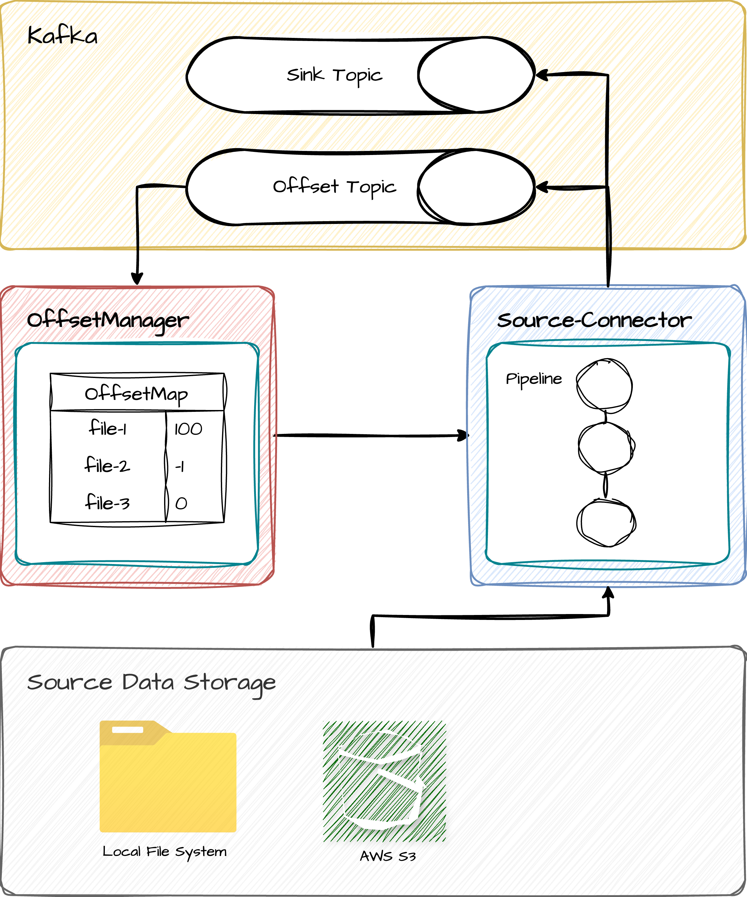
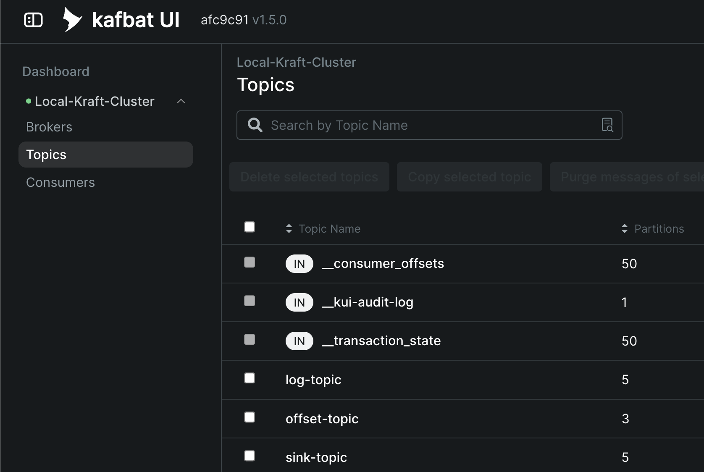
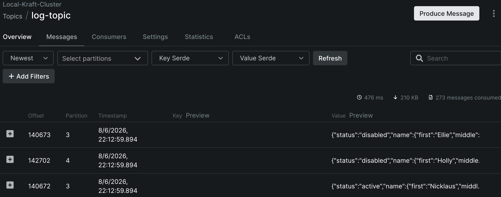

## Introduction
Source Connect provides the ETL pipeline from file source to the kafka with Exactly Once Semantics.


## Why?

## Comparison with Existing Storage Source Connectors

This section compares commonly used Kafka Source Connectors for
storage-based ingestion.

| Feature                       | Source Connect                   | Kafka Connect FilePulse      | Aiven S3 Source               | Confluent S3 Source             |
|-------------------------------|----------------------------------|------------------------------|-------------------------------|---------------------------------|
| **Delivery Semantics**        | **Exactly-once**                 | At-least-once                | At-least-once                 | At-least-once                   |
| **Storage Backends**          | Local, S3                        | Local, S3, Azure Blob, GCS   | AWS S3                        | AWS S3                          |
| **Primary Use Case**          | Reliable batch / ETL ingestion   | Flexible file ingestion      | Simple S3 ingestion           | General S3 ingestion            |
| **Supported File Formats**    | Text, CSV, **NDJSON (focused)**  | CSV, JSON, Avro, XML, Binary | JSONL, Avro, Parquet, Bytes   | Avro, CSV, JSON, Bytes, Parquet |
| **Compressed Files**          | **✅ (`.zip`, `.gz`, `.zst`)**   | ⚠️ Reader-dependent          | ✅ (`gzip`, `snappy`, `zstd`) | ❌ (Parquet internal only)      |
| **Streaming Decompression**   | ✅                               | ⚠️ Limited                   | ✅                            | ❌                              |
| **Archive Formats (zip/tar)** | ❌                               | ⚠️ Partial                   | ❌                            | ❌                              |
| **Format Parsing Model**      | Streaming line-based parsing     | Rich parsing & transforms    | Basic deserialization         | Basic deserialization           |
| **Execution Mode**            | **Standalone / Embedded**        | Kafka Connect runtime        | Kafka Connect runtime         | Kafka Connect runtime           |
| **Kubernetes Native**         | **✅ Native (ConfigMap + YAML)** | ⚠️ Via Connect / Operator    | ⚠️ Via Connect / Operator     | ⚠️ Via Connect / Operator       |
| **Operational Model**         | **Declarative (YAML-first)**     | Connect-managed lifecycle    | Connect-managed lifecycle     | Connect-managed lifecycle       |

## PreRequisites
 \


## Quick Start in local

#### (1) Launch kafka and kafka-ui
```bash
# Execute kafka brokers and kafka-ui in your host machine
$ docker-compose up -d
```

Check the kafka-ui at http://localhost:9090



#### (2) Configure the application.yml

Edit the `application.yml` file located in `source-connector/src/main/resources/application.yml` as below:

```yaml
source:
  storage:
    type: local
    paths:
      - "file:///path/to/your/directory"

    configs:
      recursive: true
      filters:
```

This configuration let source connector to read files from the specified local directory. \
And produce it to the kafka topic

#### (3) Execute the Source Connector
Set the `JOB_INDEX` environment variable for specifying single worker index 
```bash
$ JOB_INDEX=0 ./gradlew :source-connector:bootRun
```

#### (4) Verify the produced messages in kafka-ui
Go to the kafka-ui at http://localhost:9090 \
Select the topic named `sink-topic` and check the messages produced from the source connector.



#### (Optional) Execute Offset Manager

```bash
$ ./gradlew :offset-manager:bootRun
```

You should edit the `offsetManager` property in `application.yml` in source-connector module as below:
```yaml
offsetManager:
  type: http
  baseUrl: http://localhost:8080
```


## Documentation
Design notes and usage information can be found in the [wiki](https://github.com/milkcoke/source-connect/wiki)
